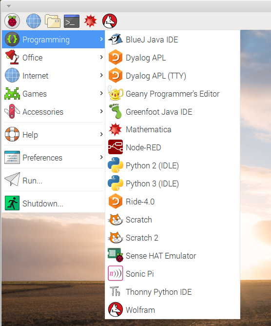
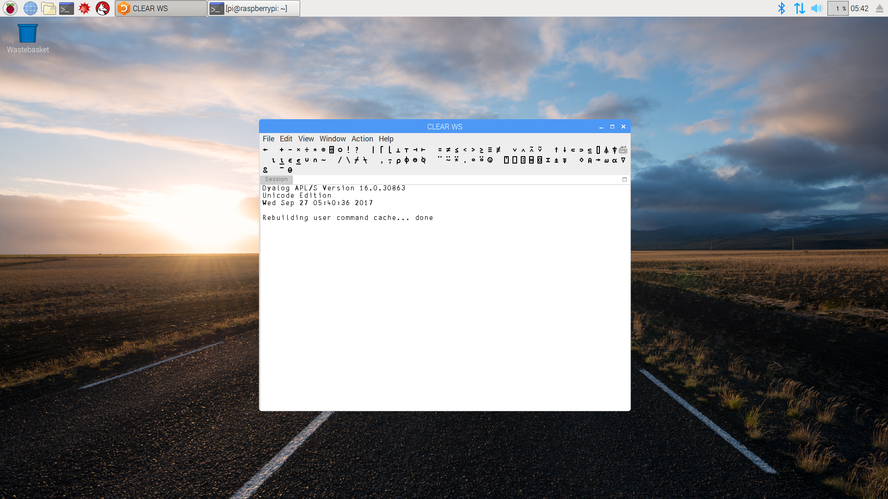
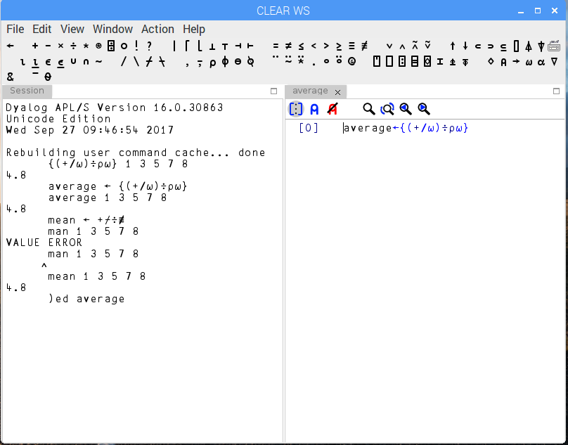

# What next?

You can now start exploring Dyalog APL on the Pi.

If you're running a Pi model 3 you may be pleasantly surprised at the responsiveness of this very
inexpensive setup. [Morten Kromberg was!](http://www.dyalog.com/blog/2017/01/morse-code-revisited-using-the-bbc-microbit/)

The Pi version is a full implementation of Dyalog APL.
If you're a current Dyalog user you should find the environment very familiar.
If, like me, you're coming back to APL after a period of absence, you might want to take a look at some of the
resources described [here](http://www.dyalog.com/dyalog/raspberry-pi.htm). You'l also find a quick guide to getting
started with RIDE below.

## Three ways to RIDE

You'll enjoy using Dyalog APL with the RIDE. It's an intuitive development environment with a lot of powerful features,
and version 4.0 runs on Raspberry Pi models 2 and 3. You can also run the RIDE on another computer to connect
to an APL interpreter that's running on the Pi.

There are three ways you can use RIDE with APL on the Pi:
1. If you have a Pi model 2 or 3 with a mouse, keyboard and monitor, you can use the RIDE on the Pi.
1. If you have a Pi model 2 or 3 with VNC enabled, you can use the VNC client on a remote computer to run a RIDE session
on the Pi, even if the Pi hasn't got a keyboard, mouse or monitor. You can find details of VNC in Appendix A; once
VNC access is set up, you'll use the RIDE in the same ways as option 1 above.
1. If you have *any* model of Pi with network access you can use the RIDE on a networked computer to run Dyalog APL on
the Pi. That's a great way to connect to and control a Pi robot.

### Running the RIDE on the PI

If you've installed Dyalog APL version 16 and RIDE 4.0 following [this process](http://packages.dyalog.com/), you should see
a couple of new Dyalog Icons when you click on the Pi's Programming Menu.

If you click on the Dyalog Icon labelled *Dyalog APL* - **not** the one with (TTY) after it - you should see
a RIDE session open on the Pi. It should look like this:

As you can see, the RIDE has an area at the top which displays the APL character set,
so you can type APl characters without worrying about the PAL keyboard layout. On the
Pi, though, APL keyboard is support is installed automatically, so you can use the Windows key
to type all the supported APL characters.

### Running the RIDE remotely

If you've installed Dyalog version 16 on a Pi that's connected to your network via ethernet or WiFi
you can connect remotely using RIDE on a Windows, Mac OS or Linux computer. You'll need
RIDE 4.0 on the remote computer, and you may also want to enable the APL keyboard.

If the remote machine has been used for APL development it probably has RIDE 4.0 installed
and the APL keyboard is probably already enabled.

If not, you can find installation instructions in the
[RIDE User Guide](http://docs.dyalog.com/16.0/RIDE%20User%20Guide.pdf)

### Developing with the RIDE

The RIDE is a very capable IDE, and its features are covered in detail in the user guide.

Below you'll find a very brief summary of the features you need to start developing in Dyalog APL.

#### Immediate Execution Mode

If you type in an APL expression in the RIDE window and press `Enter` the code will be executed
and the result (if there is one) will be displayed.

#### definition of dfns

You can create, use and save direct functions (dfns) in immediate execution mode.

To calculate an average using an anonymous dfn with the traditional* APL algorithm,
you can enter the following:

    {(+/⍵)÷⍴⍵} 1 3 5 7 8
and you;ll see the result displayed

`4.8`

You can save the dfn by assigning it:

      average ← {(+/⍵)÷⍴⍵}
      average 1 3 5 7 8
`4.8`

\* These days there's a better version which works with higher-dimensional arrays
and uses a *train*:

      mean ← +⌿÷≢
      mean 1 3 5 7 8
`4.8`

#### editing functions

You can use the RIDE editor by invoking the )ed command, or by double-clicking a name
in the RIDE session.

If you defined the function `average` as shown above, you can type
    
    )ed average
    
and an editor panel will open in the RIDE.

 

You can also use the RIDE editor to create and edit traditional functions, edit data and manage
the debugger. You'll find more details in the RIDE USer Guide.
  

##Physical computing

There's not enough space in this guide to cover the ways in which you can do Physical Computing from APL on the Pi
(driving LEDs and motors, and sensing the real world). You can read some details on 
[Morten Kromberg's blog](http://www.dyalog.com/blog/), and I hope to publish a guide to the topic
if there's enough demand.

##Other resources

If you're new to Linux you may also want to get up to speed with Raspbian, the version of Linux that you'll be
using with the Pi. There's a good book: Raspberry Pi User Guide by Eben Upton and Gareth Halfacree which you can find
on Amazon and elsewhere. Make sure you get the Second Edition!
 
There's a helpful forum on the [Raspberry Pi website](https://www.raspberrypi.org/), along with a lot of other
resources.
 
There's a monthly magazine called [the MagPi](https://www.raspberrypi.org/magpi/).
You can get it [free in pdf format](https://www.raspberrypi.org/magpi/issues/), but if you subscribe to the printed
version you'll get a free Raspberry Pi zero!

### Use the slack channel and support forum

There's a slack channel for discussing APL. You need an invitation to join. You can ask for an invitation, or
ask questions about Dyalog, on the [Dyalog Support Forum](http://www.dyalog.com/forum/).
You'll need to register before you can post.

### Join the email list

Dyalog have a mailing list which they will use to keep Pi users informed of new resources.
You can [join it here](http://www.dyalog.com/dyalog/raspberry-pi.htm#subscribe).

## Have fun!

I hope you'll have as much fun with the Pi as I do!

