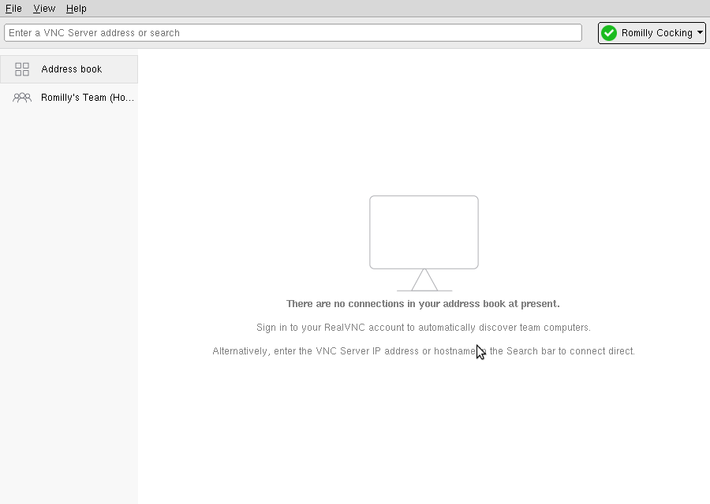
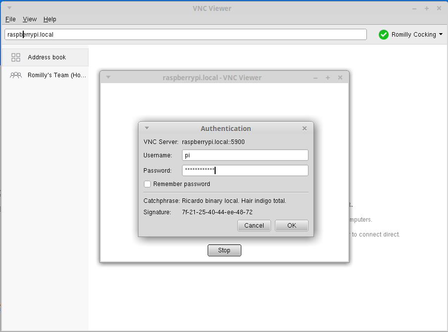

# Using a Pi without monitor, mouse or keyboard

Sometimes it isn't practical to connect your Raspberry Pi to a lot of other hardware. 
You might not have a spare keyboard or monitor available, or you might be using the Pi
to control a free-ranging robot. Fortunately you can configure and use a Raspberry Pi without the extra peripherals.

The minimal configuration consists of a Pi zero, model 1, 2 or 3 with a source of power.

The power source is usually an appropriate mains adapter, but any 5v power source will do so long as it can supply
enough current. Most robots use LiPo batteries or rechargeable NiMH cells to power their motors and their Pi.

This minimal configuration requires that the Pi already has working software installed.
You *can* configure a headless Pi from scratch over a network using another computer,
but the process is more complex and is harder to trouble-shoot.

You'll find details below, with links to more detailed information about each step.

The first part of the guide below covers initial configuration of the Pi without mouse,
screen or keyboard, which is possible but tricky.

The second part covers subsequent configuration, which is what you'll need if you want to use your Pi in a Robot or
a similar stand-alone project.
 
You will need
* a Laptop or computer (which can be an already-configured Raspberry Pi model 2 or 3) from which to configure the
target Pi and 
* a wired network connection for the Pi. (If you're using a Pi zero/zero w, you'll be aware it has no ethernet port,
but you can use an inexpensive USB-to-ethernet adapter).

It's also possible to configure a Pi zero or zero W using just a USB connection to your laptop, but this is even
trickier and not recommended until you've built up your expertise. If you *really* need to do this, you'll find details
[here](http://blog.gbaman.info/?p=699). 

There are three main steps to follow, described below:
1. You'll need to prepare an SD card for the Pi.
1. You'll need to use a protocol called ```ssh``` to connect to the Pi and prepare it for step 3.
1. You'll use a protocol called ```VNC``` to access the Pi's desktop on your laptop or workstation.

After step 3 you can use your laptop or workstation for carry out further configuration of the Pi.
In particular, you can install Dyalog APL on the Pi and use the RIDE to program and debug.

## Headless configuration details

### Understanding the security risk

The process you'll see below will enable `ssh` access to your Rasbperry Pi for anyone on your network.
Your Pi will briefly be visible as `raspberrypi.local` and anyone will be able to log in
using the default userid `pi` and password `raspberry`.

This is probably safe enough while you're just setting up the Pi, but once setup is complete
you'll need to change the login password for `pi`. The process for doing that is covered in the
instructions.

### Preparing and using the SD card

1. It's best to start with an SD card containing the latest Raspbian image. You'll find details about how to download the
image and install it on an SD card [here](https://www.raspberrypi.org/downloads/raspbian/).
**Do not** use it to boot the Pi before completing step 2 below!

1. Re-insert the freshly prepared SD card into your card reader.
Your operating system should mount the SD card and you should be able to see a partition labelled ```boot```.
Create a file called ssh in the root of the `boot` partition. Its contents do not matter.
If you're using Windows, make sure the file is called `ssh` *without any extension*.
The ssh file tells Raspbian to enable its `ssh` sever when the Pi starts up.

1. Now insert the SD card into the target Pi and connect it to the power source.

### Connecting to the Pi via ```ssh```

1. You will need an ```ssh``` client on your laptop or workstation. Installation depends on the Operation System you're
using. *On Linux* you'll need to install the ```openssh-client``` package if it is not already installed. *MacOS* should have
```ssh``` support built-in to ```Terminal```. *Windows* users will need to install a suitable client: PuTTY
(free software, widely used) is a good choice. You'll find installation instructions for PuTTY
[here](https://www.chiark.greenend.org.uk/~sgtatham/putty/latest.html).

1. You will need to enable your laptop or workstation to find the target Pi on the network.

    By default the Pi will use DHCP to request a dynamic IP address from your network which you will not know. You can sometimes find out
the Pi's IP address by connecting to your router, but there is another approach.
    
    Once the Pi is running it will broadcast itself on the network as `raspberrypi.local` using Apple's
`bonjour` protocol. Resolving that hostname to an IP address requires suitable software on your Laptop or Workstation.

    1. On *Linux* `avahi` should already be installed and running.
    1. *MacOS* should also resolve the address without additional software.
    1. If you're running *Windows*, you can install Bonjour Print Services for Windows`, available from the
[Apple Website](https://support.apple.com/kb/DL999?locale=en_GB). This will enable `Bonjour` on your Windows computer.

### Configuring the Pi

1. You will need to log in to the Raspberry Pi from your laptop or workstation. TODO: Update Windows instructions

    1. From *Linux* or *MacOs*, open a terminal window and enter ```ssh pi@raspberrypi.local```
    1. If you're using PuTTY on *Windows*, follow the PuTTY instructions to connect using ssh as user ```pi``` 
    
    Whichever method you use to connect, you are likely to see a couple of warnings.
    
    One will come from your ssh client, warning you that you have not connected to the Pi
    before and asking if you are sure you want to connect. Say yes!
    
    Once you have *connected* to the Pi you will be asked to log in. You'll see another warning that
    you are connecting vi `ssh` to a Pi that still has the default Password set. That's a security
    risk which you will address in a minute. For now, log in as user `pi` with password
    `raspberry`.
    
1. Now that you have logged in, you can configure the Pi. You'll need to run a
program called `raspi-config`. Since this program can make major changes to your configuration, you will need to run
it as *root* (the Linux super-user, equivalent to an Administrator account on Windows).

    You can do that using the `sudo` command.
    
    In your ssh session window, type `sudo raspi-config`. A menu of options should open.
    
    
    
    1. Select the first option and change pi's password. This will reduce the risk of some malicious person
    connecting to your pi using ssh and stealing all your secrets :)
    
    You will be asked to enter the new password twice, to avoid typing errors.
    
    Once you've changed the password you will be taken back to the top level menu.
    
    1. Chose the 5th option. 
    
    
    
    1. Select option 3 (VNC).
    
     
    
    1. Set the VNC option to `Yes`
    
    
    
    Now you'll be able to use VNC on another computer to connect to the PI.
    
1. Configure WiFi (*Optional*).

    If you're going to use the Pi without a wired ethernet connection to your network, you'll need to use WiFi.

    The Pi 3 and zero w have built-in WiFi; other models will need a compatible WiFi dongle.

    You can find out how to configure WiFi from the command line from this
[Raspberry Pi Website article](https://www.raspberrypi.org/documentation/configuration/wireless/wireless-cli.md).
    

## Connecting Via VNC

You'll need to install a (free) VNC client (called VNCViewer) on the workstation or computer that you want to connect
to the Pi.

You can download the Viewer from the [RealVNC website](https://www.realvnc.com/en/connect/download/viewer/).

Don't worry about the reminder you'll see to make sure you have VNC Connect installed on your target computer.
It's part of the Raspbian distribution, and you enabled it in the previous step.

You *probably* want to sign up for a VNC account. It's free, and means that you will be able
to access your Pi securely from anywhere on the Internet, but you don't have to if the Pi is
on the same network as your computer.

Follow the website's installation instructions for your OS and start VNC Viewer.

You'll see a screen like this (if you didn't create a VNC account it will look a little different):

 

 
In the entry field at the rop of the screen, enter the address of the Pi you want to
connect to. Unless you have changed the hostname of the Pi, that will still be `raspberrypi.local`. 

Press enter. You'll see a logon screen like this.


Change the username to `pi` and enter the Pi's logon password.



When you click on OK you should see the Pi's desktop displayed within a window on
your machine.


From now on you can control your Pi from your laptop or computer, just as if your keyboard, mouse and
monitor were connected to the Pi itself. 


